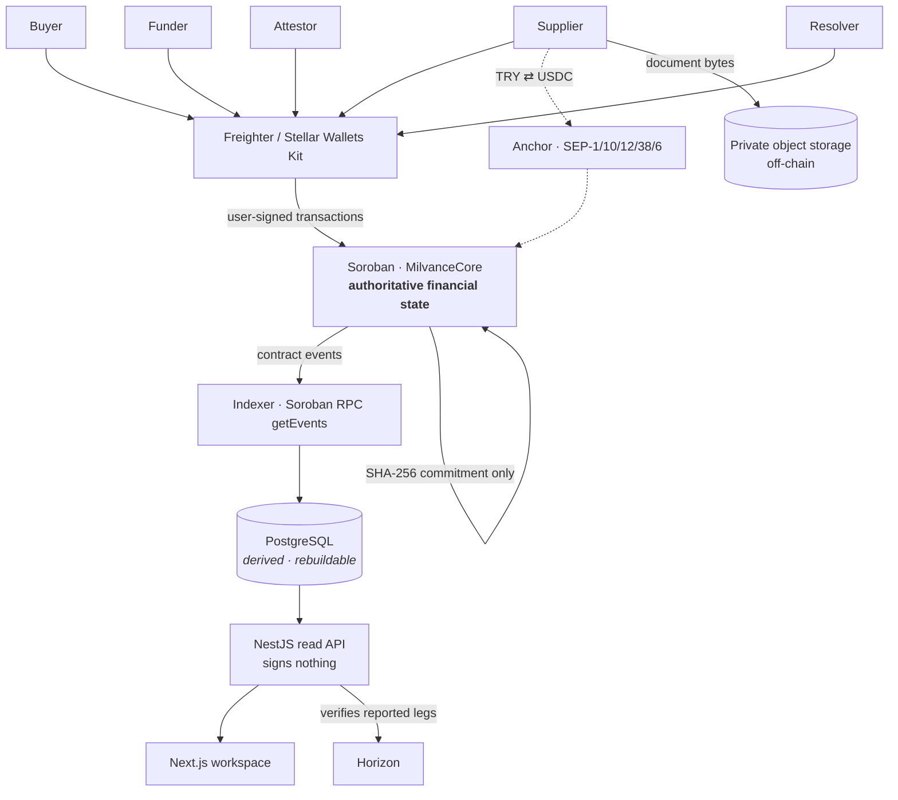

# Milvance

**Milvance converts buyer-protected production milestones into financeable working capital, and connects that capital to the local currency suppliers actually use.**

> **Buyer funds the work, not the supplier.**

_Local-payment-powered production finance on Stellar._
Commercial category: **embedded cross-border trade-finance infrastructure**.
Initial corridor: **international buyer ↔ Turkish supplier**.

|                              |                                                                                                                                                           |
| ---------------------------- | --------------------------------------------------------------------------------------------------------------------------------------------------------- |
| **Stellar Testnet contract** | [`CCN6AZHL…TKRX`](https://stellar.expert/explorer/testnet/contract/CCN6AZHLN2BQPCDZWXJGA3NRJEJ56V5JK3M4VZ5QFKQ3NSJBN6RVTKRX) — deployed, ledger 4,760,607 |
| **Live app**                 | Public deployment in final submission setup. Runs locally in one command block — see [Run locally](#run-locally).                                         |
| **Demo video**               | In final submission setup.                                                                                                                                |
| **5-minute demo**            | [docs/DEMO_RUNBOOK.md](docs/DEMO_RUNBOOK.md)                                                                                                              |
| **Architecture**             | [docs/ARCHITECTURE.md](docs/ARCHITECTURE.md)                                                                                                              |
| **Public metrics**           | [docs/METRICS.md](docs/METRICS.md) · live at `/app/metrics`                                                                                               |
| **Threat model**             | [docs/THREAT_MODEL.md](docs/THREAT_MODEL.md)                                                                                                              |

Everything runs on **Stellar Testnet** with test USDC. No real money moves.

---

## Milvance in 30 seconds

- An **international buyer** places a production order with a **Turkish supplier** and protects each milestone payment into a **Soroban contract** — committed and visible, but **not paid to the supplier**.
- A **separate financing provider (funder)** advances **their own USDC** directly to the supplier against that already-protected milestone, so production can start now.
- The supplier converts that advance to **TRY through a Stellar Anchor** and pays for materials, wages and energy — the expenses that are never denominated in USDC.
- The supplier submits **evidence**; only the **attestor named on the order** can verify it. The document stays off-chain; its **SHA-256 goes on-chain**.
- On verification the contract settles **atomically and funder-first**: the funder is repaid out of escrow before the supplier receives the remainder.
- If a milestone is disputed, a named **resolver** refunds the buyer — and that dispute is **isolated to that milestone**, not the whole order.

That is the entire economic mechanism. Everything below is evidence that it works.

---

## The problem

A Turkish manufacturer wins a €50,000 order from a European buyer. Production starts in three weeks. Before any money arrives they must pay for fabric, dye, electricity, local logistics and wages — **in lira, now**.

Both sides are stuck in the same impasse:

- **The buyer will not prepay.** Prepaying the supplier transfers production and delivery risk to the buyer, for goods that do not exist yet, across a border where enforcement is expensive.
- **The supplier cannot start without cash.** A confirmed order is not working capital. Cross-border shipping stretches the gap between "order confirmed" and "paid" by weeks more.

Today the side with more leverage wins. The supplier borrows at punitive rates, factors the invoice at a discount, or turns the order down. Trade finance exists for exactly this gap and reaches large established exporters — not the workshop with forty machines.

And there is a second problem that crypto usually ignores: **a supplier who receives USDC has not been paid.** They have been given something they must still convert before it becomes useful. A dye house does not invoice in stablecoin.

## How Milvance works

Without any blockchain vocabulary:

1. The buyer commits milestone money to a neutral place where **nobody can spend it early**.
2. A financing provider sees that commitment and lends the supplier **its own money** against it.
3. The supplier turns that money into **local currency** and starts producing.
4. Someone both sides trust **inspects the work** and says yes or no.
5. On yes, the committed money pays the financier back **first**, and the supplier keeps the rest.
6. On no, a named decider returns the money to the buyer.

```text
 Buyer ──── protects milestone ────▶ MilvanceCore escrow      locked · not supplier cash
                                            │
 Funder ─── advances own capital ───▶ Supplier                spendable today
                                            │
                                      Anchor ▼  SEP-6 / SEP-38
                                           TRY  ─── materials · wages · energy
                                            │
 Supplier ── evidence (SHA-256) ──▶ Attestor verifies
                                            │
                              settle_milestone (atomic)
                                    ├── Funder repaid first
                                    └── Supplier remainder
```

## Buyer escrow ≠ Funder advance

**This is the distinction the whole product rests on.** If it blurs, Milvance is just an escrow platform.

|                            | Buyer milestone prefunding      | Funder advance                         |
| -------------------------- | ------------------------------- | -------------------------------------- |
| Flow                       | Buyer → **MilvanceCore escrow** | Funder → **Supplier**                  |
| Capital source             | The buyer                       | The **funder's own, separate** capital |
| Spendable by the supplier? | **No** — locked in the contract | **Yes** — immediately                  |
| Released when              | Verification, at settlement     | At `fund_advance()`                    |
| Who carries the risk       | Buyer risks non-delivery        | **Funder** risks supplier performance  |

**Buyer escrow is never the source of the supplier's advance.** If it were, the buyer would be prepaying after all — just with extra steps.

This is also why Milvance is **not DeFi lending**: there is no pool, no yield farm, no liquidation engine, and no anonymous collateral. There is one named funder, one named supplier, one protected milestone, and a repayment priority the contract enforces.

The two colours in the UI carry exactly this meaning and nothing else: **blue is protected buyer money, green is funder capital.**

## Why Stellar

Stellar is not a branding choice here. Four distinct responsibilities are carried by four Stellar components:

| Component               | Responsibility in Milvance                                                                                                                |
| ----------------------- | ----------------------------------------------------------------------------------------------------------------------------------------- |
| **Soroban**             | Financial state machine: escrow, financing state, duplicate-financing prevention, authorization, repayment priority, settlement, disputes |
| **Stellar USDC**        | Shared cross-border settlement asset between buyer, funder and supplier                                                                   |
| **Anchors / SEPs**      | Local-money interoperability — the TRY edge                                                                                               |
| **Stellar Wallets Kit** | User-controlled authorization; every financial action is signed by its own actor                                                          |

### The Soroban removal test

Without Soroban, these facts move back into a private platform database:

```text
is the milestone funded?     is a finance request open?
was an offer accepted?       who owns repayment priority?
already financed?            verified?  disputed?  settled?
```

A financing provider would then have to **trust the platform's database** — the same database owned by the party that benefits from the answers. Shared, independently verifiable financing state is the product. **PostgreSQL here is a derived read model, not the financial source of truth**; delete it and `indexer replay` rebuilds it from Stellar.

### The Stellar removal test

Remove Stellar entirely and the system becomes a bank + FX provider + escrow provider + lender ledger + payment processor + platform database + reconciliation service. The financial state stops living in one shared programmable environment, and the trust model changes.

## Why local payments (Anchor)

**Our users do not live in USDC.** A Turkish supplier needs TRY to buy materials and pay workers. A Turkish financing provider may start with TRY capital.

```text
TRY  ⇅  Anchor (SEP-1 · SEP-10 · SEP-12 · SEP-38 · SEP-6)  ⇅  Stellar USDC
```

So the Anchor is not an optional "withdraw" button at the end — it is the **local-money edge of the product**, and it appears at both ends of the finance cycle:

```text
local capital ─▶ Anchor ─▶ USDC ─▶ Milvance financing ─▶ supplier
                                                            │
                                                          Anchor
                                                            ▼
                                                           TRY ─▶ materials, wages, energy
```

Without it, Milvance would be a crypto financing demo instead of a local-payments product.

**Honest boundary:** the Stellar side of every conversion is verified against Horizon — asset, direction, wallet and exact amount. **The fiat side is the Anchor's word.** No blockchain can prove a bank transfer happened, and Milvance does not claim otherwise.

---

## What actually works today

Every item below is running on `main` against the deployed Testnet contract, not mocked.

**Soroban contract — real on-chain state**

- ✅ MilvanceCore **deployed on Stellar Testnet**, 180 contract tests
- ✅ Buyer milestone protection (escrow held by the contract)
- ✅ Finance requests, funding offers, offer acceptance
- ✅ **Funder capital sent directly to the supplier**, never routed through buyer escrow
- ✅ One active finance position per milestone — duplicate financing rejected on chain
- ✅ Funder independence enforced: the funder cannot be the buyer, supplier, attestor or resolver
- ✅ Evidence **SHA-256 commitment** on chain
- ✅ Authorized attestation — only the address named on the order can verify
- ✅ **Funder-first atomic settlement** — repayment priority enforced by the contract
- ✅ Milestone-isolated dispute and refund
- ✅ A missed deadline alone moves no funds

**Application — real user-authorized transactions**

- ✅ **Stellar Wallets Kit / Freighter** signing; the backend signs nothing
- ✅ Role-aware workspace — the same order renders differently for each of the five roles
- ✅ **Trade Lab** with shareable invite links and QR codes for multi-party demos
- ✅ Animated guided tour at `/demo` that replays real indexed Testnet history, **no wallet required**
- ✅ Anchor **TRY ⇄ USDC** flow driven entirely from the browser
- ✅ Soroban RPC **event indexer** → PostgreSQL derived read model → NestJS read API
- ✅ `indexer replay` rebuilds every read model from chain; reconcile endpoints compare any row to the contract
- ✅ Public metrics where every figure carries its definition and provenance

**What is simulated, stated plainly**

- The Anchor is a **sandbox** (`tr-mock-anchor.fly.dev`). **KYC and the bank leg are simulated.** Its "simulate bank transfer" control exists only because no real bank is involved.
- **Stellar transfers in that flow are real Testnet transactions**, signed in Freighter and verifiable on Horizon. The simulation is the fiat side, not the chain side.

## Verifiable Testnet proof

A complete trade was run live from a browser with a human approving **fourteen transactions** in Freighter across **five separate accounts**. The strongest representative proofs:

| Capability                         | What happened                                                                   | Public proof                                                                                                               |
| ---------------------------------- | ------------------------------------------------------------------------------- | -------------------------------------------------------------------------------------------------------------------------- |
| Contract deployment                | MilvanceCore deployed, ledger 4,760,607                                         | [`72cb01b9…`](https://stellar.expert/explorer/testnet/tx/72cb01b9e681ec2861ce56fecac0fadad9884cc773226b353080d9b1dd69a1b4) |
| Wallet-authorized contract call    | `create_order` signed in Freighter, ledger 4,761,475                            | [`5fafed67…`](https://stellar.expert/explorer/testnet/tx/5fafed67546e55aa79f441a5fdd5932bd4038bd05e3cc3af4c820e522c5783ee) |
| Buyer protects a milestone         | `fund_milestone` — 10 USDC into escrow                                          | [`40faf6a1…`](https://stellar.expert/explorer/testnet/tx/40faf6a1e0339597ea38a6ff87b33642edf455fcffccf0ac521b0469a7a7c8ec) |
| **Funder → Supplier advance**      | `fund_advance` — 8 USDC of the **funder's own capital**, direct to the supplier | [`86c67e16…`](https://stellar.expert/explorer/testnet/tx/86c67e161050ad339c242baf3b45db9a4e82c4df60cbf13083e4e506c9c5b52b) |
| Authorized attestation             | `attest_milestone` by the named attestor only                                   | [`68638b22…`](https://stellar.expert/explorer/testnet/tx/68638b229a2b48553781b1d6ac8d645859ce39e999c9aec01811cd68285ab664) |
| **Funder-first settlement**        | `settle_milestone` — 9 USDC to funder, 1 USDC to supplier, atomically           | [`2349bf5a…`](https://stellar.expert/explorer/testnet/tx/2349bf5a7ecf355c2f3a489fad035e038fc2e8196c039fcd1e148844fe55c35d) |
| Dispute → refund                   | `resolve_dispute` — full 10 USDC returned to the buyer                          | [`d6d3bf75…`](https://stellar.expert/explorer/testnet/tx/d6d3bf75fb4450dd1901f3662689f054792ac00241c4a440d536bf7c1922229f) |
| TRY → USDC (on-ramp)               | 1,000.00 TRY → 20.3960908 USDC via SEP-6                                        | [`cc50640a…`](https://stellar.expert/explorer/testnet/tx/cc50640ab6bd9e377e5fedad276186c748d7d92a7b75c15e1aafd5182e1415fa) |
| **USDC → TRY (supplier off-ramp)** | 20 USDC out, 970.82 TRY to the supplier — **completes the finance cycle**       | [`4cbcfc00…`](https://stellar.expert/explorer/testnet/tx/4cbcfc00ec92e9ef6644578d047c27c871f24edb4130db249d2a65dad70911ff) |

All fourteen hashes, in order, with the two bugs the live run exposed and fixed: [docs/PRODUCT_WORKSPACE.md](docs/PRODUCT_WORKSPACE.md).

### The live economic proof, in numbers

Order #2 carried two 10 USDC milestones, and they ended differently on purpose.

**First milestone — financed and settled** (chain milestone #2)

```text
Buyer protected      10 USDC  ──▶ contract escrow
Funder advanced       8 USDC  ──▶ supplier        (funder's own capital, direct)
Attestor verified the evidence
Settlement            9 USDC  ──▶ funder          (repaid FIRST)
                      1 USDC  ──▶ supplier        (remainder)
```

**Second milestone — disputed and refunded** (chain milestone #3)

```text
Buyer protected      10 USDC  ──▶ contract escrow
Buyer opened a dispute
Resolver refunded    10 USDC  ──▶ buyer
```

Why this matters:

- Buyer escrow and the funder advance stayed **economically separate** throughout — escrow never funded the advance.
- **Repayment priority was enforced by the contract**, not by anyone's good behaviour.
- The dispute was **isolated to its own milestone**; the financed milestone settled normally.
- The order completed with the contract **holding no stranded funds**.

---

## Architecture



In words, because a diagram should never be the only copy of a fact:

- **Soroban is the authoritative financial state.** Escrow balances, finance positions, repayment priority, verification and settlement live there and nowhere else.
- **PostgreSQL is a derived read model.** It is written only by the indexer, only from events the deployed contract actually emitted, and it can be dropped and rebuilt from Stellar at any time. `indexer replay` does exactly that; the reconcile endpoints compare any row against the contract on demand.
- **The API signs nothing.** It holds no key, no seed and no user signature. It serves projections and verifies reported Anchor legs against Horizon.
- **The browser authorizes everything.** Every financial action is signed by its own actor in their own wallet.
- **Evidence bytes stay off-chain** in a private bucket; only the 32-byte SHA-256 goes on chain.

## Stellar stack

| Technology                          | Why it is here                                     |
| ----------------------------------- | -------------------------------------------------- |
| **Soroban SDK 28** (Rust)           | Escrow and financing state machine                 |
| **Stellar CLI 28**                  | Build, deploy and inspect the contract             |
| **`@stellar/stellar-sdk` 16**       | Transaction assembly and contract reads            |
| **Stellar Wallets Kit / Freighter** | User-controlled transaction authorization          |
| **Generated contract bindings**     | Type-safe calls from the deployed contract spec    |
| **Stellar USDC (SAC)**              | The settlement asset all parties share             |
| **Soroban RPC `getEvents`**         | Event source for the indexer                       |
| **Horizon**                         | Independent verification of reported payment legs  |
| **SEP-1**                           | Anchor discovery from `stellar.toml`               |
| **SEP-10**                          | Anchor authentication, signed by the user's wallet |
| **SEP-12**                          | Customer/KYC status with the Anchor (sandbox)      |
| **SEP-38**                          | Firm quoted TRY ⇄ USDC rates                       |
| **SEP-6**                           | Deposit and withdrawal transfers                   |

The SEP-10 session stays in the browser and **never reaches our servers**. The local-payment endpoint rejects any field shaped like a credential rather than silently dropping it.

## Five roles

| Role         | Does                                                            | Touches money                                           |
| ------------ | --------------------------------------------------------------- | ------------------------------------------------------- |
| **Buyer**    | Creates the order, protects each milestone payment, can dispute | Yes — into escrow                                       |
| **Supplier** | Accepts the order, requests financing, submits evidence         | Yes — receives the advance and the settlement remainder |
| **Funder**   | Offers financing and advances their own USDC                    | Yes — pays the supplier, is repaid first                |
| **Attestor** | Checks evidence against what was promised, verifies on chain    | No                                                      |
| **Resolver** | Decides a disputed milestone: settle or refund                  | No                                                      |

Authorization is **role-aware and contract-enforced**. A role named in a URL grants nothing — permissions come from the addresses stored on the order and are re-checked by the contract when a transaction is signed.

## User experience

The workspace speaks business language, not chain language. Users see **protected milestone**, **working capital**, **funding offer**, **advance received**, **convert to TRY**, **evidence**, **verification**, **settlement**, **dispute** — not XDR, SAC or ledger internals.

- **`/demo`** — an animated replay of a real Testnet trade. No wallet, no signup. The escrow meter visibly stays still while the funder's advance moves, so the core distinction is _seen_ rather than read.
- **`/app`** — connect Freighter and the same order renders for whichever role your wallet holds.
- **Trade Lab** — invite links and QR codes so five people can play five roles in a live demo.
- Every transaction reports its own stage honestly, including _"Confirmed on Stellar. The workspace has not caught up yet."_

## 5-minute demo

|      |                                                                                   |
| ---- | --------------------------------------------------------------------------------- |
| 0:00 | The problem — a supplier with an order and no lira                                |
| 0:30 | **Local money in** — TRY → USDC through the Anchor                                |
| 1:00 | **Buyer protects a milestone** — 10 USDC into the contract                        |
| 1:35 | **Financing** — request, offer, accept, and the funder advances 8 USDC of its own |
| 2:15 | **The distinction** — escrow still holds 10 while the supplier holds 8            |
| 2:30 | **Local money out** — supplier converts USDC → TRY                                |
| 2:55 | **Evidence and attestation** — SHA-256 on chain, named attestor verifies          |
| 3:30 | **Settlement** — 9 to the funder first, 1 to the supplier, atomically             |
| 3:55 | **Dispute isolation** — second milestone refunded, first unaffected               |
| 4:20 | **Traction and why Stellar**                                                      |

Full script with recovery paths for anything that breaks on stage: [docs/DEMO_RUNBOOK.md](docs/DEMO_RUNBOOK.md).

## Traction

Published live at `/app/metrics` and derived from indexed contract events — never hand-entered. Values below were read from the metrics API for this README.

**Protocol Testnet activity** — includes our own demo wallets, and says so:

| Metric                            | Value                                                    |
| --------------------------------- | -------------------------------------------------------- |
| Orders created / completed        | 3 / 1                                                    |
| Milestones protected              | 2 (20.0000000 USDC)                                      |
| Advances funded                   | 1 (8.0000000 USDC)                                       |
| Settlements                       | 1 — 9.0000000 USDC to funder, 1.0000000 USDC to supplier |
| Disputes → refunds                | 1 → 1 (10.0000000 USDC returned to the buyer)            |
| Distinct wallets                  | 5                                                        |
| TRY onboarded / paid to suppliers | 2,000.00 / 970.82                                        |

**North-star metric — Completed Local-Payment Finance Cycles: `1`**

One cycle has now completed end to end: a milestone was protected, financed by an independent funder, verified, settled funder-first, and the supplier's USDC was converted to TRY through the Anchor — with the Stellar leg confirmed against Horizon ([`4cbcfc00…`](https://stellar.expert/explorer/testnet/tx/4cbcfc00ec92e9ef6644578d047c27c871f24edb4130db249d2a65dad70911ff)).

**External / non-team adoption: `0`**

Zero, and the page says zero. External participation is **opt-in and self-declared**; nothing is inferred from behaviour, so no amount of our own demo activity can inflate it. Five wallets have interacted with the contract and none has classified itself as external.

**One reported Anchor leg failed verification, and is published as failed.** Building Horizon verification caught one of our _own_ records claiming a transaction that actually paid a different account. It is stored as `MISMATCHED` with the reason and **supports no metric**. We would rather publish a number we can defend than one we cannot.

Definitions, populations and provenance labels for all 29 metrics: [docs/METRICS.md](docs/METRICS.md).

## Security and trust boundaries

Stated plainly, because a submission that hides these is worse than one that does not have them.

**What the architecture guarantees**

- The backend **never holds a user private key or seed**, and **signs no user financial transaction**.
- **Soroban is the financial source of truth.** PostgreSQL is derived and rebuildable; editing it changes nothing financial and is erased by replay.
- **Raw evidence stays off-chain** in a private bucket; only a SHA-256 commitment goes on chain.
- A SEP-10 token never reaches our servers.
- A missed deadline alone never moves funds.

**What you are trusting instead — these are people, not cryptography**

- **The attestor** decides whether physical work matches what was promised. The contract enforces _who_ decides, never whether they decided correctly.
- **The resolver** decides a disputed milestone. The contract enforces only that the named resolver decided.
- **The Anchor** holds and pays local currency. No blockchain can prove a bank transfer.
- **The funder carries supplier performance risk.** A refund returns escrow to the buyer and the supplier **keeps** the advance already paid; recovering it is an off-chain matter. **Buyer escrow is not a guarantee to the funder.**

Full analysis, including what a compromise of each component would cost: [docs/THREAT_MODEL.md](docs/THREAT_MODEL.md).

## Technical stack

Rust + Soroban SDK 28 · TypeScript · Next.js 16 · NestJS · PostgreSQL + Prisma · Vitest · Turborepo + pnpm workspaces · Docker.

Money is **never a JavaScript float**: i128 amounts are carried as `bigint`, stored as exact integer base units, and formatted only at the presentation boundary.

## Run locally

Requires Node ≥ 20.19, pnpm 10.22, PostgreSQL 14+, and (for the contract) Rust with the `wasm32v1-none` target plus Stellar CLI 28.

```bash
createdb milvance && psql -c "CREATE USER milvance PASSWORD 'milvance' SUPERUSER"

pnpm install
cp .env.example .env                       # local defaults already match the above
pnpm --filter @milvance/api db:migrate     # prisma migrate deploy — never resets
pnpm build
```

Then three processes:

```bash
pnpm --filter @milvance/api start          # read API on :3001
pnpm --filter @milvance/api indexer watch  # keeps the read model current
pnpm --filter @milvance/web dev            # app on :3000
```

Open **http://localhost:3000**. The first indexer pass backfills the entire trade history from Stellar starting at the contract's deployment ledger, so a clean checkout has real data within a minute. You need [Freighter](https://freighter.app) on Testnet only for the wallet flows — `/demo` works without one.

Verify it came up correctly:

```bash
curl localhost:3001/api/health/ready       # database, RPC and indexer, separately
pnpm e2e                                   # 76 read-only checks end to end
```

## Tests

```bash
pnpm verify    # lint, typecheck, tests, build, contract tests, contract build
```

| Suite                               | Count           | Covers                                                                |
| ----------------------------------- | --------------- | --------------------------------------------------------------------- |
| **Soroban contract** (`cargo test`) | **180**         | Every financial invariant and adversarial case                        |
| **Workspace / API** (`vitest`)      | **606**         | Projector, indexer, read models, Anchor adapter, money formatting, UI |
| **End to end** (`pnpm e2e`)         | **76**          | Read-only property checks against a running deployment                |
| **Live Testnet proof**              | 14 transactions | A full multi-role trade, signed by humans in Freighter                |

The adversarial invariants are the point of the contract suite: a stranger cannot verify, a funder cannot be a party to the trade, a milestone cannot be financed twice, repayment can never be less than principal or more than escrow, a settled milestone cannot settle again, and expiry alone moves nothing.

The e2e suite checks properties rather than screenshots — that escrow splits exactly, that an advance never exceeds the protected amount, that event ordering holds, and that a settlement hash really exists on Horizon.

CI runs the Node workspace, the Soroban contract, and a **secret-hygiene job** that fails the build if private files or key material are ever tracked.

## Known limitations

These are MVP boundaries, deliberately chosen — not defects.

- **Testnet only**, with test USDC. No real money moves.
- **The Anchor is a sandbox.** KYC and the bank leg are simulated; the Stellar transfers are real.
- **Attestation is human.** Milvance does not verify physical goods and does not claim to.
- **A refund does not reverse a funder's advance.** Deliberate — clawing back money already spent on materials would defeat the purpose — but it means the funder takes supplier performance risk.
- **An on-chain position is not a legal receivable assignment** without a legal wrapper in the relevant jurisdictions.
- **Non-custodial does not mean unregulated.** Holding no keys removes custody risk, not money-transmission or lending obligations.
- **No external users yet**; the traction page reports zero rather than dressing up team activity.
- **Not publicly deployed yet.** It runs locally today.
- **No partial settlement**, no attestor rotation, no appeal beyond the named resolver.

## Roadmap

| Phase                   | Focus                                                                                                                                        |
| ----------------------- | -------------------------------------------------------------------------------------------------------------------------------------------- |
| **A — Validation**      | Harden the contract; interview sourcing platforms, suppliers and financing providers; validate buyer milestone prefunding; legal analysis    |
| **B — Pilot**           | One sourcing platform with its existing buyers and suppliers, one regulated financing partner, one local-payment partner                     |
| **C — Production**      | Audits, mainnet, production Anchor integration, KYB/KYC, legal assignment documents, SDK and webhooks, logistics and inspection attestations |
| **D — Capital network** | Multiple funders, risk policy engine, quote competition, corridor pricing                                                                    |
| **E — Multi-corridor**  | More verticals, more fiat corridors, more Anchors                                                                                            |

The first commercial customer is a **cross-border sourcing or production-management platform** that already matches international buyers with Turkish manufacturers but cannot finance them. Milvance is infrastructure such a platform embeds, not a consumer marketplace.

## Why Milvance fits the Genesis Track

| Judging dimension                       | Evidence in this repository                                                                                                                                                                                                                                                  |
| --------------------------------------- | ---------------------------------------------------------------------------------------------------------------------------------------------------------------------------------------------------------------------------------------------------------------------------- |
| **Meaningful idea & real-world impact** | A named, concrete gap — confirmed order, no local working capital — in a real corridor (international buyer ↔ Turkish supplier), solved without asking the buyer to absorb production risk. The local-currency edge is the mechanism, not a feature.                         |
| **Technical implementation**            | A deployed Soroban state machine with real authorization, real token movement and enforced repayment priority — not a backend simulation. 180 contract tests covering adversarial cases. Correct storage and state modelling; exact integer money throughout.                |
| **Stellar ecosystem fit**               | Load-bearing across four components: Soroban, USDC SAC, Wallets Kit, and Anchor SEP-1/10/12/38/6 — plus Soroban RPC for indexing and Horizon for independent verification. Remove any one and the product changes shape.                                                     |
| **User experience**                     | Business vocabulary over chain jargon; role-aware workspace; Trade Lab invites and QR codes for multi-party demos; a wallet-free animated tour of real history; honest transaction states including "not caught up yet".                                                     |
| **Traction & onboarding**               | Public metrics derived from indexed events, with definitions and provenance published next to every value. Team activity and external adoption are separated, and external adoption honestly reads zero. One north-star cycle completed end to end and confirmed on Horizon. |
| **Continuity**                          | A credible first customer (sourcing/production platforms), a five-phase roadmap to a pilot and mainnet, and a codebase built to be handed over: documented architecture, threat model, ADRs, CI and a reproducible deployment.                                               |
| **Presentation & documentation**        | This README, plus architecture, threat model, metrics, demo runbook, deployment guide, per-package guides and architecture decision records.                                                                                                                                 |

We do not score ourselves. Every row above points at something you can open and check.

## Documentation

| Document                                                              | What it covers                                        |
| --------------------------------------------------------------------- | ----------------------------------------------------- |
| [Product narrative](docs/PRODUCT_NARRATIVE.md)                        | The problem, the users, the value proposition         |
| [Architecture](docs/ARCHITECTURE.md)                                  | How the pieces fit and who is authoritative           |
| [Threat model](docs/THREAT_MODEL.md)                                  | What is enforced, what is trusted, what is accepted   |
| [Demo runbook](docs/DEMO_RUNBOOK.md)                                  | The 5-minute script and its recovery paths            |
| [Product workspace](docs/PRODUCT_WORKSPACE.md)                        | The live multi-role run, transaction by transaction   |
| [Local payments](docs/ANCHOR_LOCAL_PAYMENTS.md)                       | SEP integration and the TRY ⇄ USDC proofs             |
| [Public metrics](docs/METRICS.md)                                     | All 29 metric definitions, populations and provenance |
| [API read layer](docs/API_READ_LAYER.md)                              | Indexer, cursor, replay, reconciliation               |
| [Trade Lab](docs/TRADE_LAB.md) · [Wallet layer](docs/WALLET_LAYER.md) | Multi-party demo flow · wallet integration            |
| [Deployment](docs/DEPLOYMENT.md) · [Submission](docs/SUBMISSION.md)   | Public deployment · the short version for judges      |
| [ADRs](docs/adr/)                                                     | Architecture decisions and why they were made         |

## Built by

**Fatmanur Ergen** — solo builder. Contract, indexer, API, web app, Anchor integration, tests and documentation in this repository are all one person's work.

## Built for

**Stellar Pro Hackathon 2026 — Genesis Track.**

## License

[MIT](LICENSE)
